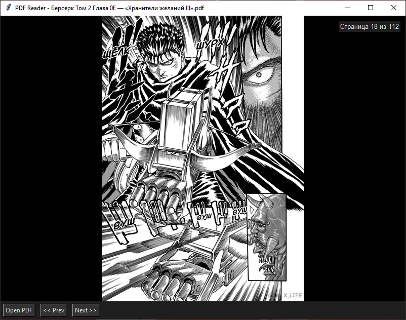

# 📖 MangaReader

**MangaReader** — это минималистичная читалка PDF-файлов (манги, комиксов и др.), написанная на Python с использованием Tkinter и PyMuPDF. Поддерживает просмотр страниц, ресайз изображения под размер окна, горячие клавиши, полноэкранный режим.



## ✨ Возможности

- 📖 Быстрая загрузка PDF
- ⬅️➡️ Навигация по страницам
- 🌌 Полноэкранный режим (F11)
- 🔧 Ресайз изображения при изменении окна
- 🎹 Горячие клавиши: `Ctrl+O`, `←/→`, `F11`, `Esc`

---

**MangaReader** is a minimalist PDF viewer for reading manga or comics, built with Python, Tkinter, and PyMuPDF. It supports page navigation, image resizing, keyboard shortcuts, and fullscreen mode.


## ✨ Features

- 📖 Fast PDF loading
- ⬅️➡️ Page navigation
- 🌌 Fullscreen mode (F11)
- 🔧 Auto-resize images to fit window
- 🎹 Keyboard shortcuts: `Ctrl+O`, `←/→`, `F11`, `Esc`

---

## 🔧 Requirements

- Python 3.10+
- [`PyMuPDF`](https://pypi.org/project/PyMuPDF/)
- `Pillow`

Установить зависимости:
```bash
pip install PyMuPDF Pillow
